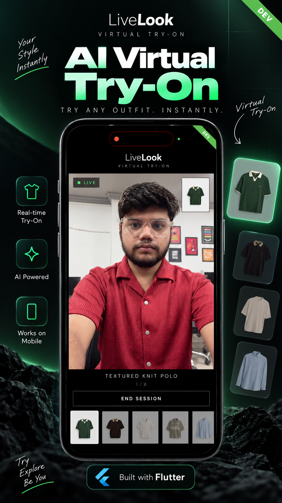

# LiveLook — Virtual Try-On

Real-time virtual try-on for Flutter. Point the camera at yourself, pick a
garment from the strip, and the live video feed comes back wearing it — no
photo upload, no render step, no waiting.

The stream is produced by the [Decart](https://decart.ai) realtime `lucy-vton`
model. Decart ships no Dart SDK, so the app talks to the native Android and
iOS SDKs across a platform channel and renders the returned frames in a
platform view.

## Demo

[](https://lnkd.in/p/dak9WnFP)

▶️ **[Watch the demo on LinkedIn](https://lnkd.in/p/dak9WnFP)**

## How it works

```
 Flutter (Dart)                  Platform channels              Native
┌──────────────────────┐        ┌──────────────────┐        ┌────────────────────┐
│ CatalogViewModel     │        │ livelook/decart  │        │ DecartPlugin       │
│  reads catalog.json  │        │  (MethodChannel) │───────▶│  Kotlin  /  Swift  │
│                      │        │                  │        │                    │
│ SessionViewModel     │───────▶│ .../events       │◀───────│ Decart SDK session │
│  owns the session    │        │  (EventChannel)  │        │  camera + WebRTC   │
│                      │        └──────────────────┘        │                    │
│ CameraViewModel      │        ┌──────────────────┐        │ DecartVideo        │
│  permission gate     │        │ PlatformView     │◀───────│  PlatformView      │
└──────────────────────┘        └──────────────────┘        └────────────────────┘
```

- **`DecartSessionService`** is a deliberately dumb wrapper over the method
  channel — it marshals arguments and surfaces errors, and holds no state.
- **`SessionViewModel`** owns everything the UI reacts to: connection status,
  the busy flag, and error messages pushed up from the SDK.
- **Sessions are capped at 60 seconds** (`SessionViewModel.autoDisconnectSeconds`)
  because a live session bills for its whole duration.
- **Garment switches are debounced 350 ms** so swiping through the strip
  uploads only the garment the user settles on, not every one they pass.
- **Connects time out after 45 s** — without that ceiling a stalled handshake
  pins the UI in `connecting`, where the only recovery is restarting the app.

## Project layout

```
lib/
├── core/                        # Shared plumbing — no feature knowledge
│   ├── config/env.dart          # Flavor-aware .env loading
│   ├── services/                # Api client, storage, permissions, dialogs
│   ├── routes/  theme/  widgets/  utils/  extensions/
│   └── constants/assets.gen.dart
└── features/try_on/
    ├── models/garment_model.dart
    ├── repositories/catalog_repository.dart
    ├── services/decart_session_service.dart   # Method/event channel bridge
    ├── view_models/                           # camera / catalog / session
    └── views/                                 # try_on_screen + widgets

android/app/src/main/kotlin/com/livelook/app/decart/   # Kotlin bridge
ios/Runner/Decart/                                     # Swift bridge
assets/data/catalog.json                               # 8 bundled garments
assets/garments/                                       # their images
```

Architecture rules the code is held to live in [.github/rules/](.github/rules/) —
one file each for the core layer, view models, views, data layer, services, and
Riverpod codegen.

## Requirements

| | |
| --- | --- |
| Flutter | Dart SDK `>=3.10.0 <4.0.0` |
| Android | `com.github.DecartAI:decart-android:0.7.10` (JitPack) |
| iOS | `DecartSDK` via Swift Package Manager, deployment target **17.0** |
| Credentials | A Decart API key (`dct_*`) — see [Configuration](#configuration) |

Both platforms need a real device with a camera. Simulators and emulators
won't produce a usable stream.

## Getting started

```bash
flutter pub get
dart run build_runner build --delete-conflicting-outputs
```

Then create the env files (see below) and run a flavor:

```bash
flutter run --flavor development -t lib/main_development.dart
flutter run --flavor staging     -t lib/main_staging.dart
flutter run --flavor production  -t lib/main.dart
```

For iOS dev there's a helper script: [run_ios_dev.sh](run_ios_dev.sh). VS Code
launch configs are in [.vscode/launch.json](.vscode/launch.json).

## Configuration

Three gitignored env files drive the flavors: `.env.development`,
`.env.staging`, `.env.production`. Each is loaded by `flutter_dotenv` and read
through [lib/core/config/env.dart](lib/core/config/env.dart).

```bash
# ─── Decart ───────────────────────────────────────────────────────────
API_BASE_URL=https://api.decart.ai
API_WS_BASE_URL=wss://api.decart.ai
API_VERSION=v1

# Realtime virtual try-on model.
DECART_REALTIME_MODEL=lucy-vton-latest

# Long-lived Decart API key. ONLY set this in development/staging — it can
# mint client tokens, so it must never ship in a release binary.
DECART_API_KEY=dct_your_key_here

# Backend that mints ephemeral client tokens (POST -> {apiKey, expiresAt}).
# Required in production, optional in development.
TOKEN_ENDPOINT=

ENABLE_LOGS=true
ENABLE_ANALYTICS=false
ENABLE_CRASH_REPORTING=false
```

`SessionViewModel.prepare()` resolves a key in this order: a user-supplied key
in `SecureStorageService`, then `Env.decartApiKey`. Production is meant to
leave `DECART_API_KEY` blank and go through `TOKEN_ENDPOINT` instead.

> ⚠️ **A bundled `.env` is not encrypted.** Anyone with the APK or IPA can
> unzip it and read a `dct_*` key in plain text — no reverse engineering
> needed, and that key is a full account credential. The token-endpoint fix is
> scaffolded but unwired; the risk is currently accepted for internal testers
> only. Read [docs/api-key-security.md](docs/api-key-security.md) before
> shipping any build that leaves that group.

## The garment catalog

Eight garments ship in the bundle: [assets/data/catalog.json](assets/data/catalog.json)
holds the metadata, `assets/garments/` holds the images (~2.1 MB total).

Each entry pairs a photo with the prompt sent to the model:

```json
{
  "id": "m1",
  "name": "Textured Knit Polo",
  "type": "polo",
  "description": "Dark green textured knit polo with cream contrast collar and sleeve trim",
  "prompt": "Substitute the upper body garment with a dark green textured knit polo shirt with an open cream V-neck collar, cream short sleeve cuffs, and a small cream script logo on the chest",
  "image": "assets/garments/polo-green-textured.jpg"
}
```

Prompt wording matters more than the image does — the model leans on it
heavily, so garment prompts are written to be specific and consistent

Bundling keeps the catalog working with no network and no credentials.
Moving it server-side touches four files and is planned but not started —
see [docs/dynamic-catalog.md](docs/dynamic-catalog.md).

## Tech stack

- **State** — `hooks_riverpod` + `flutter_hooks` + `riverpod_annotation`
  (codegen via `riverpod_generator`)
- **Flavors** — `development` / `staging` / `production`, separate entry
  points and `.env.*` files, per-flavor iOS `.xcconfig`
- **Networking** — `dio` + `pretty_dio_logger`
- **Storage** — `flutter_secure_storage`, `shared_preferences`
- **UI** — `flutter_screenutil`, `flutter_svg`, `toastification`,
  `loading_animation_widget`
- **Notifications** — `awesome_notifications`
- **Utilities** — `connectivity_plus`, `permission_handler`, `package_info_plus`
- **Tooling** — `flutter_gen_runner`, `flutter_launcher_icons`,
  `flutter_native_splash`

## Code generation

After changing any Riverpod-annotated provider, run `build_runner`. After
adding or removing files under `assets/`, run `flutter_gen` to regenerate the
typed `AppAssets` class in [lib/core/constants/](lib/core/constants/).

```bash
# Riverpod providers + any other build_runner-based generators
dart run build_runner build --delete-conflicting-outputs

# Watch mode (regenerates on file changes)
dart run build_runner watch --delete-conflicting-outputs

# Asset class (AppAssets) — flutter_gen
dart run flutter_gen_runner
# or simply:
fluttergen -c pubspec.yaml
```

### App icon & splash screen

```bash
# Regenerate launcher icons from assets/icons/app_logo.png
dart run flutter_launcher_icons

# Regenerate native splash from assets/icons/app_splash.png
dart run flutter_native_splash:create

# Remove the native splash
dart run flutter_native_splash:remove
```

## Scaffolding a feature — VS Code task

A VS Code task creates the MVVM folder structure for a new feature so you
don't hand-make the folders every time.

1. Command Palette → **Tasks: Run Task**
2. Select **Flutter: Create MVVM Feature**
3. Pick the base folder (`lib/features`)
4. Enter the feature name (e.g. `auth`, `home`, `profile`)

This creates ->

```
lib/features/<feature_name>/
├── model/
├── view/
├── viewmodel/
└── repository/
```

The task is defined in [.vscode/tasks.json](.vscode/tasks.json).

## Tests

```bash
flutter test
```

Coverage sits on the try-on feature: the catalog repository and view model,
the camera permission view model, the session view model, and a widget test
over the screen itself. Tests swap in a
[fake asset bundle](test/support/fake_asset_bundle.dart) and a fake permission
platform rather than touching real channels.

## Known gaps

| Item | Status |
| --- | --- |
| [API key ships inside the bundle](docs/api-key-security.md) | Open — deferred for internal testers, must be fixed before any external build |
| [Remote garment catalog](docs/dynamic-catalog.md) | Proposed — blocked on picking a backend |
